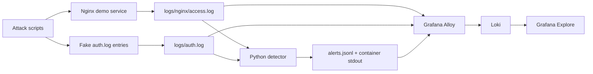
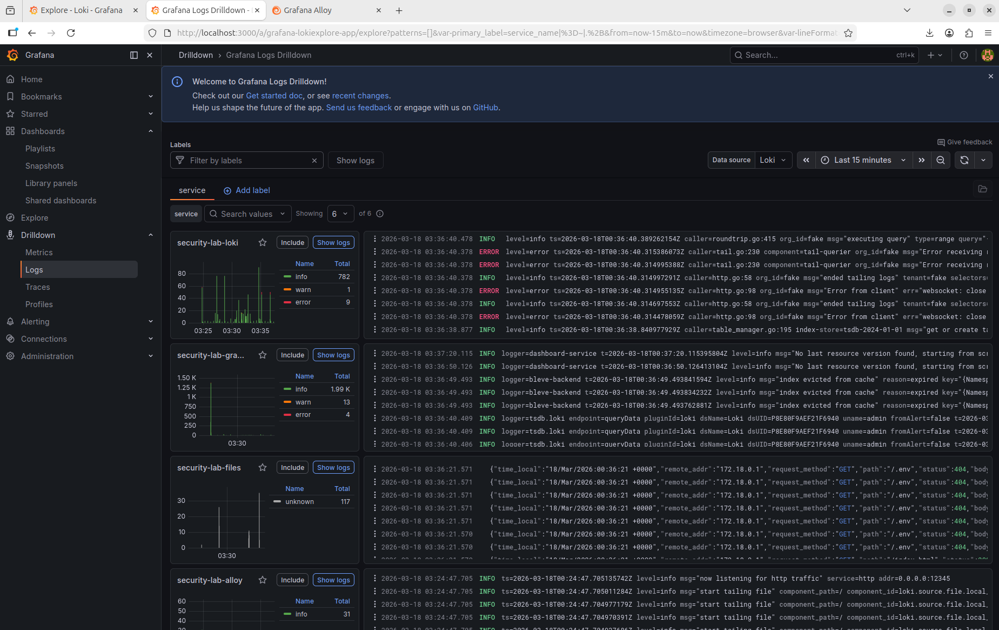
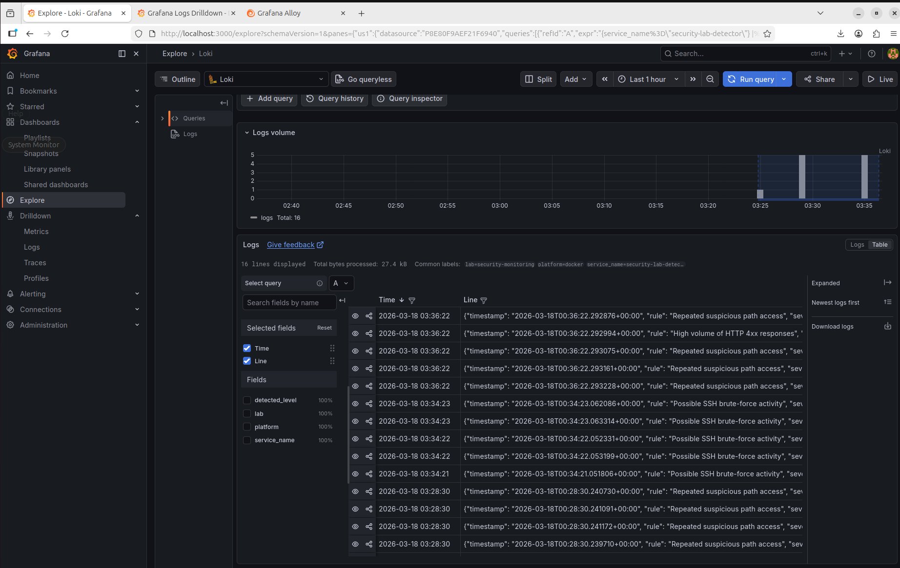
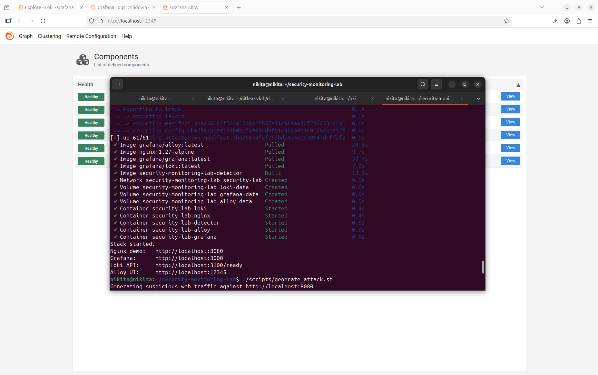

# Security Monitoring Lab


A compact **Ubuntu 24.04-friendly security monitoring lab** built for local demos, portfolio use, and interview walkthroughs.

This project shows a practical detection workflow without the overhead of a full SIEM stack:
- collect logs from local files and containers;
- centralize them in **Grafana Loki**;
- explore activity in **Grafana**;
- detect suspicious behavior with a lightweight **Python rules-based detector**.

It is intentionally small, readable, and easy to demo on a laptop or VM.

---

## Why this project matters

This repository is designed to match infrastructure / application support / junior security roles where you need to show that you can:
- work with **Linux** and **Docker Compose**;
- understand **log pipelines** and telemetry collection;
- investigate suspicious events in a central platform;
- build simple but clear **security detections**;
- explain how monitoring can be extended toward a real SOC workflow.

Instead of building an oversized lab, this project focuses on a clean, interview-friendly story: **logs → visibility → detection → alerts**.

---

## Stack

- **Docker Compose** — local deployment
- **Grafana Loki** — log storage
- **Grafana Alloy** — log collection agent
- **Grafana** — log exploration and visualization
- **Nginx** — demo web service generating access logs
- **Python detector** — simple threshold-based alerting logic

> Note: this lab uses **Grafana Alloy** instead of Promtail because Alloy is the current forward-looking collector in the Grafana stack.

---

## What the lab detects

### Web activity
- repeated access to suspicious paths such as `/.env`, `/wp-login.php`, `/server-status`, `/admin`;
- bursts of HTTP 4xx responses from the same source.

### Authentication activity
- repeated failed SSH-style login attempts written into `auth.log` to simulate brute-force behavior.

---

## Architecture



---

## Repository structure

```text
security-monitoring-lab/
├── app/                              # Demo Nginx web page
├── assets/
│   └── screenshots/                  # Optional screenshots for README
├── configs/
│   ├── alloy/                        # Grafana Alloy config
│   ├── grafana/                      # Provisioned data source config
│   ├── loki/                         # Loki config
│   └── nginx/                        # Nginx virtual host config
├── detector/                         # Python detector container
├── docs/                             # Useful LogQL queries and notes
├── logs/                             # Generated demo logs
├── alerts/                           # Generated alert output
├── scripts/                          # Setup, start, reset, and attack generators
├── docker-compose.yml
├── .env.example
└── README.md
```

---

## Quick start on Ubuntu 24.04

### 1) Install Docker Engine

Use the included helper script or install Docker manually.

```bash
chmod +x scripts/install_docker_ubuntu24.sh
./scripts/install_docker_ubuntu24.sh
newgrp docker
```

### 2) Prepare the environment

```bash
cp .env.example .env
chmod +x scripts/*.sh
```

### 3) Start the lab

```bash
./scripts/up.sh
```

### 4) Open the services

- Nginx demo: `http://localhost:8080`
- Grafana: `http://localhost:3000`
- Loki readiness: `http://localhost:3100/ready`
- Alloy UI: `http://localhost:12345`

Default Grafana credentials:
- **username:** `admin`
- **password:** `admin`

---

## Validate that everything works

### Check containers
```bash
docker compose ps
```

### Generate suspicious HTTP requests
```bash
./scripts/generate_attack.sh
```

### Generate fake SSH authentication failures
```bash
./scripts/generate_auth_failures.sh
```

### Watch detector alerts
```bash
./scripts/show_detector_alerts.sh
```

### Show generated alert file
```bash
cat alerts/alerts.jsonl
```

---

## Useful places to inspect

### Grafana Explore
Use the **Loki** data source and start with the queries from [`docs/useful-logql.md`](docs/useful-logql.md).

### Detector container logs
```bash
docker logs security-lab-detector
```

### Nginx access logs
```bash
tail -n 20 logs/nginx/access.log
```

### Simulated auth log
```bash
tail -n 20 logs/auth.log
```

---

## Example LogQL queries

### Detector alerts
```logql
{service_name="security-lab-detector"} | json
```

### All Nginx file logs
```logql
{job="security-lab-files", log_type="nginx"} | json
```

### Fake SSH failures
```logql
{job="security-lab-files", log_type="auth"} |= "Failed password"
```

### Suspicious web paths by source IP
```logql
sum by (remote_addr) (
  count_over_time(
    {job="security-lab-files", log_type="nginx"}
    | json
    | path=~"/(\\.env|wp-login\\.php|server-status|admin|login|phpmyadmin).*"
    [5m]
  )
)
```

---

## Screenshots

### Grafana Explore


### Detector alerts


### Running containers


## Typical demo flow for GitHub or interviews

1. Start the stack with `./scripts/up.sh`.
2. Open **Grafana Explore** and show that logs are flowing into Loki.
3. Run `./scripts/generate_attack.sh`.
4. Show suspicious paths and HTTP 4xx bursts in the logs.
5. Run `./scripts/generate_auth_failures.sh`.
6. Open `alerts/alerts.jsonl` or detector container logs.
7. Explain how this could evolve into a broader SOC-style monitoring setup.

This is usually enough to demonstrate:
- local deployment skills;
- Linux-friendly operations;
- log collection pipeline understanding;
- basic detection engineering;
- practical security thinking.

---

## Suggested screenshots for the README

If you want to make the repository look stronger, add screenshots to `assets/screenshots/` and insert them here later.

Recommended captures:
- Grafana Explore showing suspicious paths
- detector alerts in Grafana or terminal
- `docker compose ps` with all services running
- browser view of the demo service

Example placeholder names:
- `assets/screenshots/grafana-explore.png`
- `assets/screenshots/detector-alerts.png`
- `assets/screenshots/docker-compose-ps.png`
- `assets/screenshots/nginx-demo.png`

---

## Possible extensions

- add prebuilt Grafana dashboards;
- connect host-level logs instead of demo-only files;
- enrich logs with GeoIP or user-agent parsing;
- send alerts to Telegram, Slack, or email;
- replace the Python detector with a rule engine;
- add Docker metrics and container health views;
- integrate Wazuh, Falco, or Sigma-inspired rules.

---

## Reset the lab

```bash
./scripts/reset.sh
```

---

## Notes

- This is a **local educational lab**, not a production monitoring platform.
- The detector is intentionally simple so its logic is easy to read and explain.
- The project is optimized for **clarity, portability, and demo value**.

---

## Suggested GitHub topics

`security-monitoring` `detection-engineering` `log-analysis` `grafana` `loki` `grafana-alloy` `docker-compose` `nginx` `ubuntu` `infosec`

---

## License

MIT
